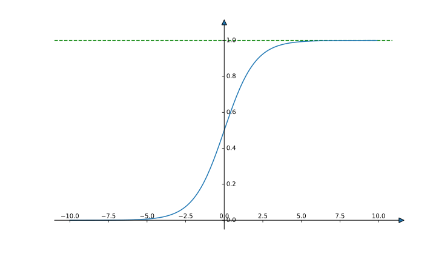

# Deep Learning notes 2

## Quick review of a Neural network
- Some quotation
- Back Calculation

## Neural Network Representation: An example

- Input Layer: Input features $x=(x_1, x_2, x_3)^T$ stacked vertically.
- $$a^{[0]}=x$$
- hidden layer. It has paramters $w^{[1]}$ and $b^{[1]}$, which shape are $(4, 3)$ and $(4, 1)$ in this example.
- $$a^{[1]}=(a_1^{[1]}, a_2^{[1]}, a_3^{[1]}, a_4^{[1]})$$
- Output layer: the final layer generate $\hat y$. It has paramters $w^{[2]}$ and $b^{[2]}$, which shape are $(1, 4)$ and $(1, 1)$ in this example.
- $$\hat y=a^{[2]}$$

## Cont. Computing a Neural Network's Output
> First step (the first node in hidden layer): 
> $$z_1^{[1]}=w_1^{[1]T}x+b_1^{[1]}$$
> $$a_1^{[1]}=\sigma(z_1^{[1]})$$
> Note: $a_i^{[l]}$, $l\leftarrow$ layer number,  $i\leftarrow$ node in layer.
> The same for the second, third ... unit.
>
> Vectorization
> $$z^{[1]}=(W^{[1]})^Tx+b$$
> $$a^{[1]}=\sigma(z^{[1]})$$
> We can replace $x$ with $a^{[0]}$.

## Vectorizing across multiple examples
- The initical code we use a for loop:
- ```for i = 1 to m:```
  - $z^{[1](i)}=W^{[1]}x^{(i)}+b^{[1]}$
  - $a^{[1](i)}=\sigma(z^{[1](i)})$
  - $z^{[2](i)}=W^{[2]}a^{[1](i)}+b^{[2]}$
  - $a^{[2](i)}=\sigma(z^{[2](i)})$
- But we can use matrix $X=(x^{(1)}, x^{(2)}, ..., x^{(m)})$ to replace all $x^{(i)}$: 
> $$Z^{[1]}=W^{[1]}X+b^{[1]}$$
> $$A^{[1]}=\sigma(Z^{[1]})$$
> $$Z^{[2]}=W^{[2]}A^{[1]}+b^{[2]}$$
> $$A^{[2]}=\sigma(Z^{[2]})$$
> Note that $Z^{[1]}=(z^{[1](1)}, z^{[1](2)}, ..., z^{[1](m)})$ stack all vector in columns.
- axis=0 all features.
- axis=1 all samples.

## Cont. Explaination
- 略

## Activation Functions
- sigmoid: 通常不用于隐藏层，最多应用于输出层（如果$\hat y$）。
- $$\sigma(z)=\frac{1}{1+e^{-z}}$$
- 
- tanh (NO arctan!!!)
- $$\tanh(z)=\frac{e^z-e^{-z}}{e^z+e^{-z}}$$
- 
- 当$z$过大或过小的时候，上述函数可能面临梯度消失的问题。
- RelU, retified linear unit, as a default choice:
- $$a(z)=\max(0, z)$$
- 
- leaky ReLU:
- $$a(z)=\max(\lambda z, z), 0<\lambda <1$$
- 

## Why do you need non-linear activation functions?
- 否则变成线性回归了

## Derivatives of activation function
> <b>sigmoid</b>
> $$g(z)=\frac{1}{1+e^{-z}}$$
> $$g'(z)=\frac{1}{1+e^{-z}}\left(1-\frac{1}{1+e^{-z}} \right )=g(z)(1-g(z))$$
> ---
> <b>tanh</b>
> $$g(z)=\frac{e^z-e^{-z}}{e^z+e^{-z}}$$
> $$g'(z)=1-\left ( \frac{e^z-e^{-z}}{e^z+e^{-z}}
\right)^2=1-g^2(z)$$
> ---
> <b>ReLU</b>
> $$g(z)=max(0, z)$$
> 
> $$ g'(x)=\left\{ \begin{aligned} 0 &\quad if \ \ z<0,  \\1 &\quad if \ \ z\geq0 \end{aligned}\right.$$


## Gradient descent for neural network
- parameters: $w^{[1]}$, $b^{[1]}$, $w^{[2]}$, $b^{[2]}$ with shape $(n^{[1]}, n^{[0]})$, $(n^{[1]}, 1)$, $(n^{[2]}, n^{[1]})$, $(n^{[2]}, 1)$, respectively.
- Where $n_x=n^{[0]}, n^{[1]}, n^{[2]}=1$ 
- Cost Function:
- $$\mathcal{J}(w^{[1]}, b^{[1]}, w^{[2]}, b^{[2]})=\frac{1}{m}\sum_{i=1}^{m}\mathcal{L}(\hat y, y)$$
- <b>Gradient descent</b>:
> Repeat {
> - compute predict $\hat y^{(i)}$, $i=1, ..., m$
> - $dw^{[1]}=\frac{\partial J}{\partial w^{[1]}}$, $db^{[1]}=\frac{\partial J}{\partial b^{[1]}}$, ...
> - $w^{[1]}:=w^{[1]}-\alpha \ dw^{[1]}$, $b^{[1]}:=b^{[1]}-\alpha \ db^{[1]}$, ...
> 
> }
- Formulas for computing derivatives:

|Forward propagation| Back propagation|
|-------------------|-----------------|
|$Z^{[1]}=W^{[1]}X+b^{[1]}$|$dZ^{[2]}=A^{[2]}-Y$|
|$A^{[1]}=g^{[1]}(Z^{[1]})$|$dw^{[2]}=\frac{1}{m}dZ^{[2]}(A^{[1]})^T$|
|$Z^{[2]}=W^{[2]}A^{[1]}+b^{[2]}$|$db^{[2]}=\frac{1}{m}dZ^{[2]}I$|
|$A^{[2]}=g^{[2]}(Z^{[2]})$|$dZ^{[1]}=(W^{[2]})^TdZ^{[2]}*g^{[1]'}(Z^{[1]})$|
|——|$dW^{[1]}=\frac{1}{m}dZ^{[1]}X^T$|
|——|$db^{[1]}=\frac{1}{m}dZ^{[1]}I$|
- Note that '$*$' is elements wise product, and $I=(1, ..., 1)^T$.
- In this example, the OUTPUT LAYER's activation function is sigmoid function. 

## Random Initialization
- 如果初始化全部是0，则所有的参数计算都将一致。
- 使用权重随机初始化，可以避免这一问题。
- we prefer very small random value to initicalize the model. 避免梯度消失。
```python
import numpy as np

W = np.random.randn((2, 2))
b = np.zero((2, 1))
```


