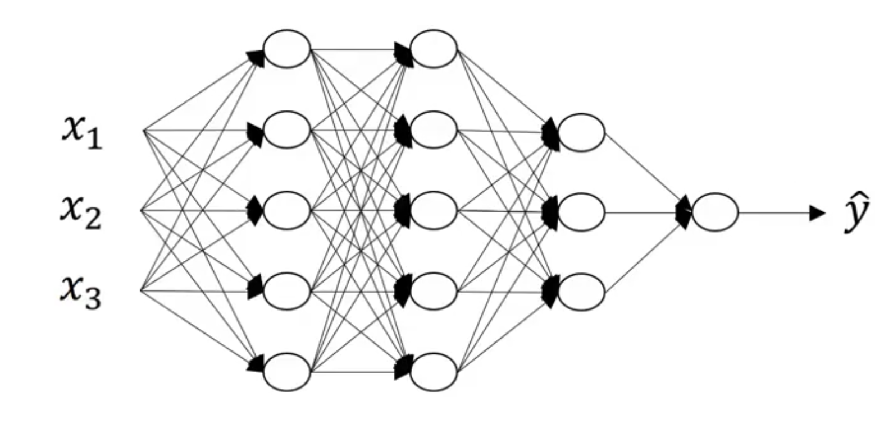
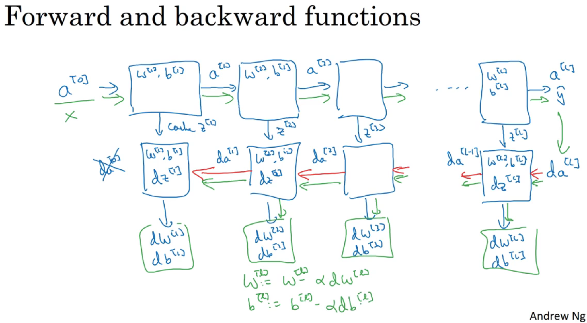

# Deep Learning Note 3

## Deep L-layer Neural Network
- Deep or Shallow?
- A Deep Neural Network.(4 hidden layers)

- Notation: 
  - Number of Layers $l=4$
  - Number of nodes(Units) $n^{[l]}$ in layer $l$. Specially, $n^{[4]}=n^{[l]}=1$ and $n^{[0]}=n_x$.
  - Activation in layer $l$. $a^{[l]}=g^{[l]}(z^{[l]})$
  - Weights for $z^{[l]}$: $W^{[l]}$, and $b^{[l]}$.

## Forward and Backward propagation
|Forward propagation|vectorization|
|----|----|
|Input layer: $x=a^{[0]}$|$X=A^{[0]}$|
|$z^{[1]}=W^{[1]}x+b^{[1]}$|$Z^{[1]}=W^{[1]}A^{[0]}+b^{[1]}$|
|$a^{[1]}=g^{[1]}(z^{[1]})$|$A^{[1]}=g^{[1]}(Z^{[1]})$|
|$z^{[2]}=W^{[2]}a^{[1]}+b^{[2]}$|$Z^{[2]}=W^{[2]}A^{[1]}+b^{[1]}$|
|...|...|
|$z^{[4]}=W^{[4]}a^{[3]}+b^{[4]}$|$Z^{[4]}=W^{[4]}A^{[3]}+b^{[4]}$|
|$a^{[4]}=g^{[4]}(z^{[4]})=\hat y$|$A^{[4]}=g^{[4]}(Z^{[4]})=\hat Y$|
- for any layer: $z^{[l]}=W^{[l]}a^{[l-1]}+b^{[l]}$ and $a^{[l]}=g^{[l]}(z^{[l]})$

## Getting your matrix dimensions right
- for layer $l$, $W^{[l]}.shape=(n^{[l]}, n^{[l-1]})$, $b^{[l]}.shape=(n^{[l]}, 1)$. 
- $dW^{[l]}$ and $db^{[l]}$ should have the same dimension as $W^{[l]}$ and $b^{[l]}$.
- $Z^{[l]}=W^{[l]}A^{[l-1]}+b^{[l]}$, then $Z^{[1]}.shape=(n^{[l]}, m)$. $dZ^{[l]}.shape=dA^{[l]}.shape=(n^{[l]}, m)$

## Why deep nn representation?
- 从简单特征入手处理，到复杂特征。
- circuit theory
  

## Building blocks of deep neural networks

## Parameters v.s. Hyperparameters
- Hyperparameters:
  - learning rate $\alpha$
  - Number of iterations
  - Number of hidden layers $L$
  - Number of hidden Unit $n^{[1]},\ n^{[2]},\ ...$
  - Choice of activation function
  - Others: Momenton, Minibatch size, regularization, ...
  - ...

