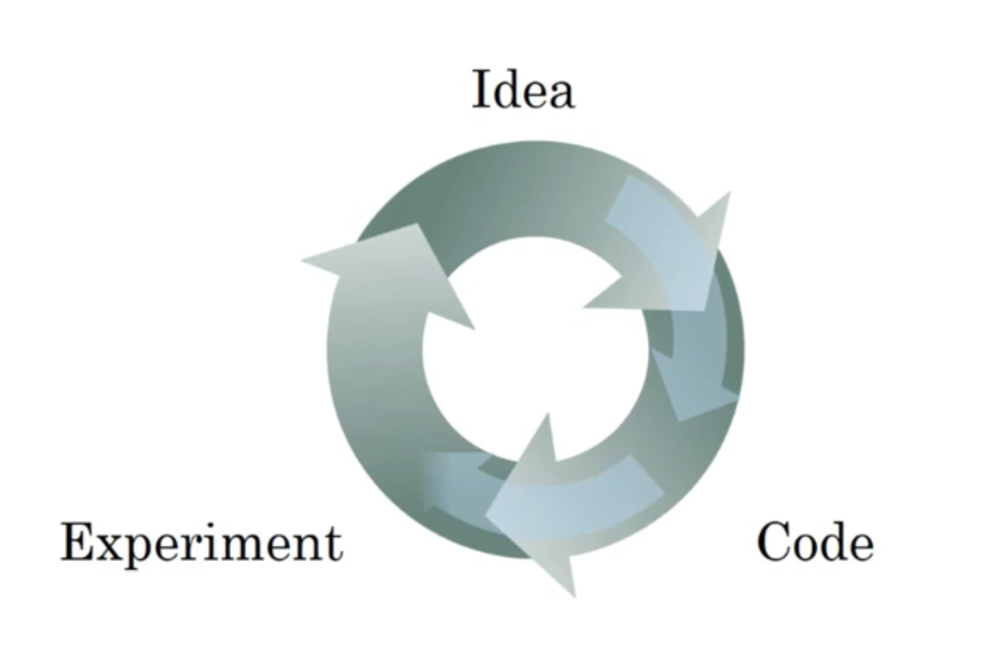
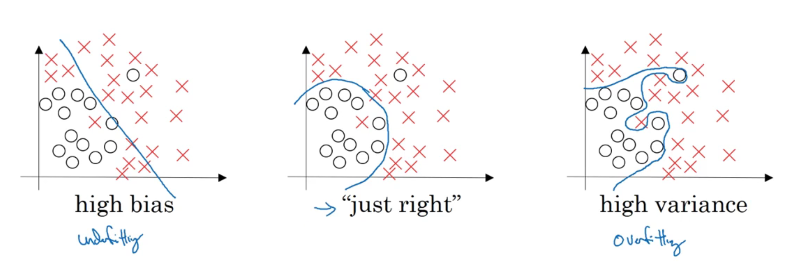
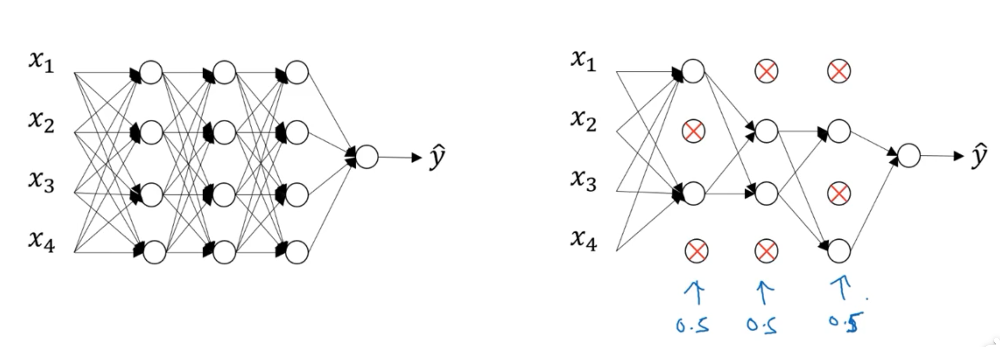
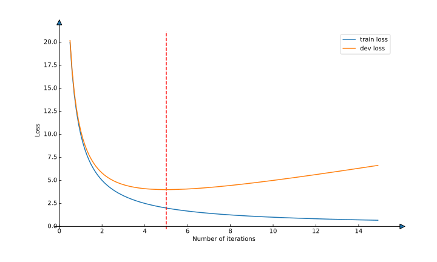
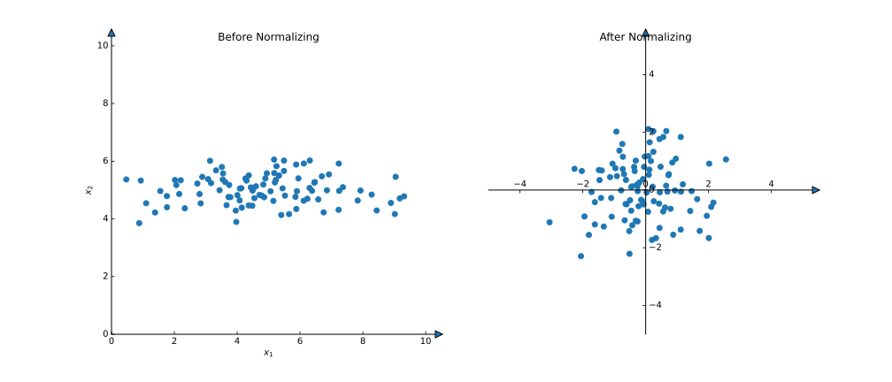

# Deep Learning Notes 4

## Applied ML is a highly iterative process
- Number of Layers
- Number of hidden units
- learning rate
- activation function
- ...


## Train/dev/test sets
- training set; 
- developed set: hold out cross validation; 
- test set;
- best practise in ML: 60/20/20; 
- But for a big dataset, may be: 98/1/1.

## Mismatched train/test distribution
- For example:
  
|Training set|Dev/test set|
|------|------|
|Cat pictures from webpages|Cat pictures from users using your App|
- Make sure dev and test set <b>come from a same distribution</b>
- Not having a test set might be okey.(Only dev set)

## Bias and Variance

- We assume that human error $\approx$ 0%, then:

|Train set error|Dev set error|Bias and Variance|
|----|----|----|
|1%|11%|high variance|
|15%|16%|high bias|
|15%|30%|high bias & high variance|
|.5%|1%|low bias & low variance|
- It may be diffient when human error $>$ 0%. (base error higher than 0%)

## Basic "recipe" for machine learning
|Problem|Recipe|
|----|----|
|High bias<br />(training data performance)|bigger network <br />train longer <br />NN architectures search|
|High variance<br />(dev set performance)|More data<br />Regularization<br />NN architectures search|
- "Bias Variance trade-off", 在大数据时代，有可能这个权衡不复存在。

## Regularization
> <b>Logistic Regression</b>
> $$\min_{w, b}\mathcal{J}(w, b)$$
> $$\mathcal{J}(w, b)=\frac{1}{m}\sum_{i=1}^{m}\mathcal{L}(\hat y^{(i)}, y^{(i)})+\frac{\lambda}{2m}||w||_2^2$$
> Where: 
> - $||w||_2^2=\sum_{j=1}^{n_x}w_i^2=w^Tw$, we call it L2 regularization.  
> - L1 regularization: $\frac{\lambda}{m}||w||_1=\frac{\lambda}{m}\sum_{i=1}^{n_x}|w|$. $w$ will be spase.  
> - $\lambda$ is the regularization parameter.
> ----
> <b>Neural Network</b>
> $$\mathcal{J}(w^{[1]}, b^{[1]}, ..., w^{[L]}, b^{[L]})=\frac{1}{m}\sum_{i=1}^{m}\mathcal{L}(\hat y^{(i)}, y^{(i)})+\frac{\lambda}{2m}\sum_{l=1}^{L}||w^{[l]}||_F^2$$
> Where: 
> - $||w^{[l]}||_F^2=\sum_{i=1}^{n^{[l-1]}}\sum_{j=1}^{n^{[l]}}(w_{ij}^{[l]})^2$, because $w^{[l]}.shape=(n^{[l-1]}, n^{[l]})$. it turns out is called the <b>Frobenius norm </b> of a matrix
> - $dw^{[l]}=(from \ backprop) + \frac{\lambda}{m}w^{[l]}$, then $w^{[l]}:=w^{[l]}-\alpha dw^{[l]}$.
> - $w^{[l]}:=(1-\frac{\alpha \lambda}{m})w^{[l]}-\alpha (from \ backprop)$, so we call it <b>weight decay</b>(权重衰减)。因为每次给原有的w的权重更小了。

## Why regularization reduces overfitting (L2 reg)
- 当$\lambda$较大时，w在梯度下降的过程中会接近0；
- w接近0，隐藏层的神经元几乎不起作用（但他们依旧存在）。
- 激活函数接近线性部分，神经网络变得简单。

## Dropout regularization (随机失活)

- 对于每个训练样本，其中的神经元随机失活，使用失活后的精简网络进行训练。
- 类似于集成学习方法，生成了一堆子网络。
- Implementing dropout (Inverted dropout)
```python
# layer 3
l = 3
keep_prob = 0.8
d3 = np.random.rand(a3.shape[0], a3.shape[1]) < keep_prob
a3 = np.multiply(a3, d3)
# 加强存在神经元的输出
a3 /= keep_prob
```
- 在测试时不考虑dropout。

## Understanding dropout
- for any unit in hidden layers, they can't rely on any one feature, so they have to spread out their weights. (shrink weights)
- Computer Vision比较常用

## Other regularization methods
- Data augmentation（数据扩增）: 图像翻转、旋转、裁剪、加入噪音...
- Early stopping（早停）: 在过拟合之前停止训练。

> ML process comprising several diffierent steps:
> - Optimize cost function $\mathcal{J}$
>   - Gradient Descend
>   - Momentum
>   - RMSprop
>   - Adam
> - Not Overfit
>   - regularization
>   - getting more data
>   - ...
> 
> This principle is called <b>Orthogonalization (正交化)</b>. You just think about one task at the same time.
- But in early stopping, you no longer can work on these two problem independently.
- 吴老师个人更喜欢L2正则化，尝试不同的$\lambda$。但是，这样的模型训练将是昂贵的。

## Normalizing Inputs
- $$x:=\frac{x-\mu}{\sigma}$$

- Gradient descent might need a lot of steps to oscilate back and forth before it finally finds its way to the minimum when we use unnormalized data!

## Vanishing/exploding gradients
- 梯度消失和梯度爆炸都使得神经网络的训练举步维艰。
- 当网络层数增多，多个矩阵相乘迭代，使得矩阵乘积数值指数级增加或减少。

## Weight initialization for deep networks
- consider one unit: $z=\sum_{i=1}^{m}w_ix_i$. larger $n$ $\rightarrow$ smaller $w_i$. so, we set $var(w_i)=\frac{1}{n}$
- In practice: $W^{[l]}=np.random.randn(W^{[l]}.shape)*np.sqrt(\frac{2}{n^{[l-1]}})$
- 这样做可以缓解梯度爆炸、梯度消失的问题
- Some variance:

|activation function|author|variance|
|----|----|----|
|ReLU|Herd et al.|$\sqrt{\frac{2}{n^{[l-1]}}}$|
|tanh|Xavier <br />(Xavier initialization)|$\sqrt{\frac{1}{n^{[l-1]}}}$|
|tanh|Yoshua Bengio|$\sqrt{\frac{2}{n^{[l-1]}+n^{[l]}}}$|

## Numerical approximation of gradients
- $$g(\theta)=f'(\theta)\approx\frac{f(\theta+\varepsilon)-f(\theta-\varepsilon)}{2\varepsilon}$$
> 双侧的数值比单侧的准确率要高。是因为双侧：
> $$f'(\theta)=\frac{f(\theta+\varepsilon)-f(\theta-\varepsilon)}{2\varepsilon}+o(\varepsilon^2)$$
> 但是单侧：
> $$f'(\theta)=\frac{f(\theta+\varepsilon)-f(\theta)}{\varepsilon}+o(\varepsilon)$$
> $\varepsilon$是一个非常小的数，$o(*)$是皮亚诺余项。

## Gardient checking
- Take $W^{[1]}, b^{[1]}, ..., W^{[L]}, b^{[L]}$ and reshape into a big vector $\theta$.
- $$\mathcal{J}(W^{[1]}, b^{[1]}, ..., W^{[L]}, b^{[L]})=\mathcal{J}(\theta)$$
- Take $dW^{[1]}, db^{[1]}, ..., dW^{[L]}, db^{[L]}$ and reshape into a big vector $d\theta$.
- <b>Check $d\theta$ is the gradient of $\mathcal{J}$</b>, $d\theta=\nabla\mathcal{J}$.
- ```for i in range(Number of params):``` 
  - $d\theta_{approx}[i]=\frac{\mathcal{J}(\theta_{-i}, \theta_i+\varepsilon)-\mathcal{J}(\theta_{-i}, \theta_i-\varepsilon)}{2\varepsilon}$
- $d\theta_{approx}[i]\approx d\theta[i]=\frac{\partial\mathcal{J}}{\partial\theta_i}$????
- check:
- $$stats=\frac{||d\theta_{approx}-d\theta||_2}{||d\theta_{approx}||_2+||d\theta||_2}$$
- given that $\varepsilon=1e-7$:
  - if $stats < 1e-7$, great!
  - if $1e-7<stat<1e-5$, take care.
  - if $stat>1e-3$, worry, may be some bugs.

## Gradient Checking implementation notes
- Don't use gradient checking in training, Only to debug! because the process is too slow!
- If algorithm fails grad check, look at components to try to identify bug.
- Remember your regularization term!
- Doesn't work with dropout!!
- Run at random initialization; perhaps again after some training.

