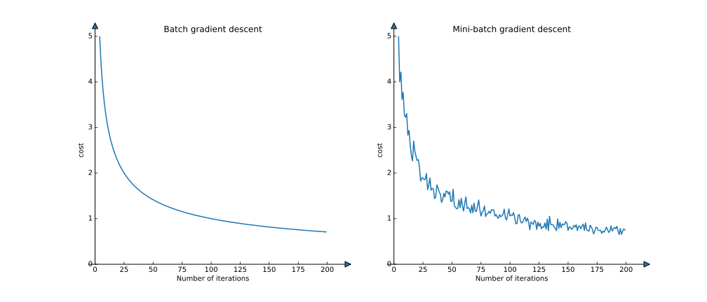
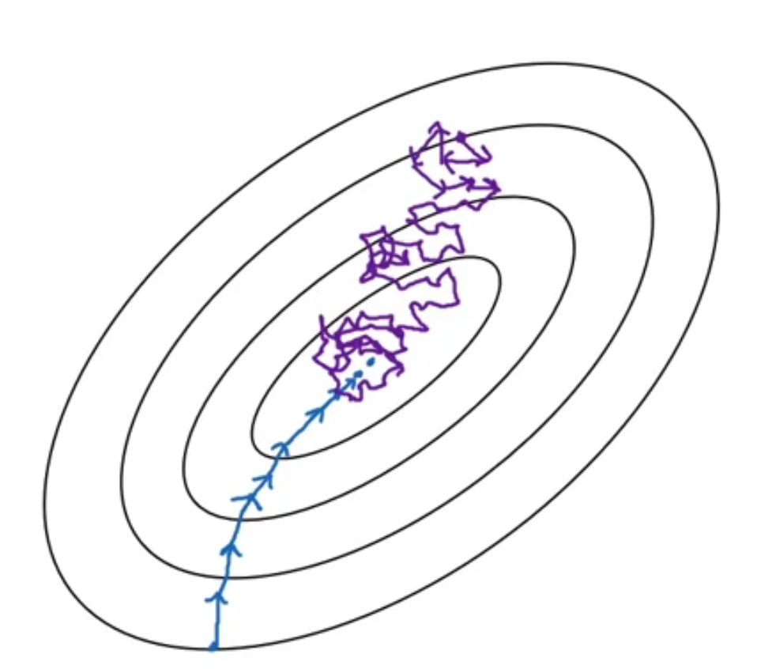
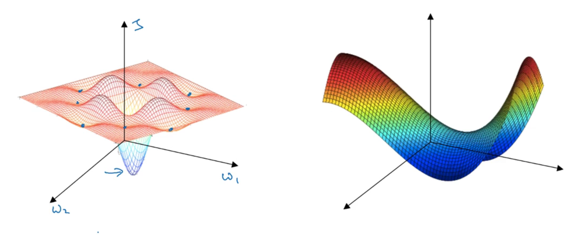

# Deep learning Notes 5
## Mini-batch gradient descent
- Vectorization allows you to efficiently compute on $m$ examples. 
- $$X=[x^{(1)}, x^{(2)}, x^{(3)}, ..., x^{(m)}]$$
- $$Y=[y^{(1)}, y^{(2)}, y^{(3)}, ..., y^{(m)}]$$
- The shapes of $X$ and $Y$ are $(n_x, m)$ and $(1, m)$
- What if the training set is giant?
- Split $X$ and $Y$ into Mini-batch!
- We use $X^{\{t\}}$ and $Y^{\{t\}}$ to index mini-batches.
- Implementation
- ```for t = 1, ..., Number of batches: ```
  - Forward prop on $X^{\{t\}}$
    - $Z^{[1]}=W^{[1]}X^{\{t\}}+b^{[1]}$
    - $A^{[1]}=g^{[1]}(Z^{[1]})$
    - ...
    - $A^{[L]}=g^{[L]}(Z^{[L]})$
  - Compute cost $\mathcal{J}^{\{t\}}=\frac{1}{bs}\sum_{i=1}^{bs}\mathcal{L}(\hat y^{(i)}, y^{(i)})+\frac{\lambda}{2*bs}\sum_l||W^{[l]}||_F^2$
    - Backprop to compute gradient of $\mathcal{J}^{\{t\}}$ (only use $(X^{\{t\}},Y^{\{t\}})$)
    - $W^{[l]}:=W^{[l]}-\alpha dW^{[l]}$
    - $b^{[l]}:=b^{[l]}-\alpha db^{[l]}$
- An epoch, which means a single pass through the training set. 
- Mini-batch gradient descent run faster than batch gradient descent.

## Understanding mini-batch gradient descent
- It will be a little bit noise when we use mini-batch to train our model.

- Choose your mini-batch size!
- If mini-batch size=$m$: Batch gradient descent; $(X^{\{1\}}, Y^{\{1\}})=(X, Y)$
- If mini-batch size=1: stochastic gradient descent; $(X^{\{1\}}, Y^{\{1\}})=(x^{(1)}, y^{(1)}), ...$


|Stochastic gradient descent|Mini-batch gradient descent|Batch gradient descent|
|----|----|----|
|mini-batch size = 1|mini-batch size not too big or too small|mini-batch size = $m$|
|Lose speeding from vectorization|Fastest learning<br />- vectorization<br />- make progress without process the entire training set|Too long per iteration|

## Exponentially weighted averanges
- $$V_t=\beta V_{t-1}+(1-\beta)\theta_t$$
- $\beta$ 越大，滞后越严重。
- 长期均值$\frac{1}{1-\beta}V$

## Understanding exponentially weighted averages
- Implement:
- $v_\theta:=0$
- $v_\theta:=\beta v+(1-\beta)\theta_1$
- $v_\theta:=\beta v+(1-\beta)\theta_2$
- 比起移动窗口计算移动平均，这种方法将占用更小的内存，更快的计算。

## Bias correction in exponentially weight average
- 初值设置为0将有可能导致前期的数据偏差。
- 误差修正方式:
- $$v_t:=\frac{v_t}{1-\beta^t}$$

## Gradient descent with momentum
- Momentum:
- On iteration $t$: 
  - Compute $dW, db$ on current mini-batch
  - $V_{dW}:=\beta V_{dW}+(1-\beta)dW$
  - $V_{db}:=\beta V_{db}+(1-\beta)db$
  - $W:=W-\alpha V_{dW}, b=b-\alpha V_{db}$
- $\beta$一般为0.9.

## Root Mean Square prop (RMSprop)
- RMSprop:
- On iteration $t$: 
  - Compute $dW, db$ on current mini-batch
  - $S_{dW}:=\beta S_{dW}+(1-\beta)dW^2$
  - $S_{db}:=\beta S_{db}+(1-\beta)db^2$
  - $W:=W-\alpha \frac{dW}{\sqrt{S_{dW}}}, b=b-\alpha \frac{db}{\sqrt{S_{db}}}$

## Adam optimization algorithm
- Adam: Adaptive Moment Estimation 
- Initialize: $V_{dW}=0, V_{db}=0, S_{dW}=0, S_{db}=0$; 
- On iteration $t$:
  - Compute $dW, db$ on current mini-batch
  - $V_{dW}:=\beta_1 V_{dW}+(1-\beta_1)dW$
  - $V_{db}:=\beta_1 V_{db}+(1-\beta_1)db$
  - $S_{dW}:=\beta_2 S_{dW}+(1-\beta_2)dW^2$
  - $S_{db}:=\beta_2 S_{db}+(1-\beta_2)db^2$
  - $V^{corrected}_{dW}=\frac{V_{dW}}{1-\beta_1^t}, V^{corrected}_{db}=\frac{V_{db}}{1-\beta_1^t}$
  - $S^{corrected}_{dW}=\frac{S_{dW}}{1-\beta_2^t}, S^{corrected}_{db}=\frac{S_{db}}{1-\beta_2^t}$
  - $W:=W-\alpha \frac{V^{corrected}_{dW}}{\sqrt{S_{dW}}+\varepsilon}, b=b-\alpha \frac{V^{corrected}_{db}}{\sqrt{S_{db}}+\varepsilon}$

- hyperparameters choice
  - $\alpha:$ needs to be tune; 
  - $\beta_1: 0.9$
  - $\beta_2: 0.999$
  - $\varepsilon: 10^{-8}$

## Learning rate decay
- remember: 1 epoch = 1 pass through data!
- $$\alpha=\frac{\alpha_0}{1+DecayRate*epochNum}$$
- other methods:
- $$\alpha=0.95^{epochNum}*\alpha_0$$
- $$\alpha=\frac{k}{\sqrt{t}}*\alpha_0$$
- ...

## The problem of local optima (局部最优)
- Local optima in Neural Networks: 

- 通常深度学习面临参数不是左边的情形，而是右边的情形。参数往往停在马鞍面上。这与我们的直觉不符。
- Problem of plateaus
- Unlikely to get stuck in a bad local optima
- Plateaus can make learning slow